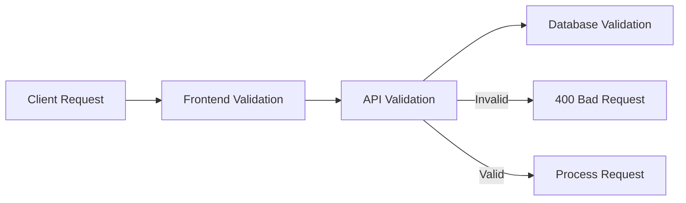

# Advanced Mapster Features and Mapping Scenarios

## Table of Contents
- [Basic Controller Implementation](#basic-controller-implementation)
- [Complex Mapping Scenarios](#complex-mapping-scenarios)
- [Custom Property Mapping](#custom-property-mapping)
- [Conditional Mapping](#conditional-mapping)
- [Navigation Property Mapping](#navigation-property-mapping)
- [Best Practices](#best-practices)

## Basic Controller Implementation

```csharp
[ApiController]
[Route("api/[controller]")]
public class PollsController : ControllerBase
{
    private readonly IPollService _pollService;
    private readonly IMapper _mapper;

    public PollsController(IPollService pollService, IMapper mapper)
    {
        _pollService = pollService;
        _mapper = mapper;
    }

    // GET: api/polls
    [HttpGet]
    public IActionResult GetAll()
    {
        var polls = _pollService.GetAll();
        var response = polls.Adapt<IEnumerable<PollResponse>>();
        return Ok(response);
    }
    // Response: [{"id":1,"title":"Poll 1","description":"Description 1"},...]

    // POST: api/polls
    [HttpPost]
    public IActionResult Add([FromBody] CreatePollRequest request)
    {
        var newPoll = _pollService.Add(request.Adapt<Poll>());
        return CreatedAtAction(
            nameof(Get), 
            new { id = newPoll.Id }, 
            newPoll.Adapt<PollResponse>());
    }
    // Response: {"id":1,"title":"New Poll","description":"New Description"}

    // PUT: api/polls/{id}
    [HttpPut("{id}")]
    public IActionResult Update(
        [FromRoute] int id, 
        [FromBody] CreatePollRequest request)
    {
        var isUpdated = _pollService.Update(id, request.Adapt<Poll>());
        return !isUpdated ? NotFound() : NoContent();
    }
    // Response: 204 No Content
}
```

## Complex Mapping Scenarios

### Domain Models
```csharp
public class Student
{
    public int Id { get; set; }
    public string FirstName { get; set; } = string.Empty;
    public string MiddleName { get; set; } = string.Empty;
    public string LastName { get; set; } = string.Empty;
    public DateTime? DateOfBirth { get; set; }
    public Department Department { get; set; } = default!;
}

public class Department
{
    public int Id { get; set; }
    public string Name { get; set; } = string.Empty;
}
```

### DTOs
```csharp
public class StudentResponse
{
    public int Id { get; set; }
    public string FullName { get; set; } = string.Empty;
    public int? Age { get; set; }
    public string DepartmentName { get; set; } = string.Empty;
}
```

### Mapping Configuration
```csharp
public class MappingConfigurations : IRegister
{
    public void Register(TypeAdapterConfig config)
    {
        config.NewConfig<Student, StudentResponse>()
            // Combine multiple properties into one
            .Map(dest => dest.FullName, 
                src => $"{src.FirstName} {src.MiddleName} {src.LastName}")
            
            // Calculate age with null checking
            .Map(dest => dest.Age, 
                src => DateTime.Now.Year - src.DateOfBirth!.Value.Year,
                srcCond => srcCond.DateOfBirth.HasValue)
            
            // Map from nested object
            .Map(dest => dest.DepartmentName, src => src.Department.Name);

        // Enable two-way mapping
        config.NewConfig<Student, StudentResponse>()
            .TwoWays();
    }
}
```

### Test Endpoint
```csharp
[HttpGet("test")]
public IActionResult Test()
{
    var student = new Student
    {
        Id = 1,
        FirstName = "Mohammad",
        MiddleName = "Abd-El-Shafy",
        LastName = "KhairAllah",
        DateOfBirth = new DateTime(1994, 12, 28),
        Department = new Department
        {
            Id = 1,
            Name = "Test"
        }
    };

    var response = student.Adapt<StudentResponse>();
    return Ok(response);
}
// Response: {
//   "id": 1,
//   "fullName": "Mohammad Abd-El-Shafy KhairAllah",
//   "age": 29,
//   "departmentName": "Test"
// }
```

## Best Practices

1. **Property Name Conventions**
   ```csharp
   // Mapster will automatically map DepartmentName to Department.Name
   // No need for explicit configuration unless different naming
   public string DepartmentName { get; set; }
   ```

2. **Null Handling**
   ```csharp
   .Map(dest => dest.Age, 
       src => DateTime.Now.Year - src.DateOfBirth!.Value.Year,
       srcCond => srcCond.DateOfBirth.HasValue)
   ```

3. **Ignoring Properties**
   ```csharp
   // Using configuration
   .Ignore(dest => dest.PropertyName)

   // Using attribute
   [AdaptIgnore]
   public string PropertyName { get; set; }
   ```

4. **Two-Way Mapping**
   ```csharp
   // Enable bidirectional mapping
   config.NewConfig<Student, StudentResponse>()
       .TwoWays();
   ```

5. **Projection Support**
   ```csharp
   // Efficiently select only needed properties
   var response = dbContext.Students
       .ProjectToType<StudentResponse>()
       .ToList();
   ```

## Advanced Features

1. **Custom Value Transformations**
   ```csharp
   .Map(dest => dest.FullName, 
       src => string.Join(" ", src.FirstName, src.MiddleName, src.LastName)
           .Trim())
   ```

2. **Conditional Mapping**
   ```csharp
   .Map(dest => dest.Status, 
       src => src.Age > 18 ? "Adult" : "Minor",
       srcCond => srcCond.DateOfBirth.HasValue)
   ```

3. **Nested Object Mapping**
   ```csharp
   .Map(dest => dest.DepartmentInfo, src => new
   {
       src.Department.Name,
       src.Department.Code
   })
   ```

4. **Collection Mapping**
   ```csharp
   config.NewConfig<List<Student>, List<StudentResponse>>()
       .Map(dest => dest, src => src.Select(x => x.Adapt<StudentResponse>()));
   ```

These advanced features demonstrate Mapster's flexibility in handling complex mapping scenarios while maintaining clean and maintainable code.

# Data Validation in .NET Core APIs

## Table of Contents
- [Introduction](#introduction)
- [Built-in Validation Attributes](#built-in-validation-attributes)
- [Common Validation Patterns](#common-validation-patterns)
- [Implementation Examples](#implementation-examples)
- [Best Practices](#best-practices)

## Introduction

Data validation is crucial in APIs for:
- Ensuring data integrity
- Protecting against malicious inputs
- Maintaining application reliability
- Providing clear feedback to clients



## Built-in Validation Attributes

| Attribute | Description | Example | .NET Version |
|-----------|-------------|---------|--------------|
| `[AllowedValues]` | Specifies allowed values | `[AllowedValues("A", "B", "C")]` | ≥8 |
| `[Base64String]` | Validates Base64 encoding | `[Base64String]` | ≥8 |
| `[Compare]` | Compares two properties | `[Compare("PasswordConfirm")]` | All |
| `[CreditCard]` | Validates credit card numbers | `[CreditCard]` | All |
| `[EmailAddress]` | Validates email format | `[EmailAddress]` | All |
| `[Length]` | Validates length range | `[Length(5, 50)]` | ≥8 |
| `[Phone]` | Validates phone numbers | `[Phone]` | All |
| `[Range]` | Validates numeric range | `[Range(1, 5)]` | All |
| `[Required]` | Makes field mandatory | `[Required]` | All |
| `[RegularExpression]` | Validates against pattern | `[RegularExpression(@"\d+")]` | All |

## Common Validation Patterns

### Regular Expression Patterns
```csharp
public static class ValidationPatterns
{
    public const string Password = @"(?=.*[0-9])(?=.*[A-Z])(?=.*[!@#$%^&*]).{8,}";
    public const string Username = @"^[a-zA-Z0-9._@-]{3,20}$";
    public const string CharactersOnly_Eng = @"^[a-zA-Z_]*$";
    public const string CharactersOnly_Ar = @"^[\u0600-\u065F\u066A-\u06EF\u06FA-\u06FF]*$";
    public const string MobileNumber = @"^01[0,1,2,5]{1}[0-9]{8}$";
    public const string NationalID = @"^[2,3]{1}[0-9]{13}$";
}
```

## Implementation Examples

### Using Records (Modern Approach)
```csharp
public record CreatePollRequest(
    [Required(ErrorMessage = "Title is required")]
    [Length(1, 100, ErrorMessage = "Title must be between 1 and 100 characters")]
    [RegularExpression(@"^[\u0600-\u065F\u066A-\u06EF\u06FA-\u06FF]*$", 
        ErrorMessage = "Only Arabic characters are allowed")]
    string Title,

    [MaxLength(500)]
    string? Description
);
```

### Using Classes (Traditional Approach)
```csharp
public class CreatePollRequest
{
    [Required]
    [StringLength(100, MinimumLength = 1)]
    public string Title { get; init; } = string.Empty;

    [MaxLength(500)]
    public string? Description { get; init; }
}
```

### Controller Implementation
```csharp
[ApiController]
public class PollsController : ControllerBase
{
    [HttpPost]
    public IActionResult Create(CreatePollRequest request)
    {
        // [ApiController] handles validation automatically
        // If validation fails, returns 400 Bad Request
        // If validation passes, continues with the logic
        var poll = request.Adapt<Poll>();
        // ... rest of the implementation
    }
}
```

## Best Practices

1. **Multiple Validation Layers**
   ```mermaid
   graph TD
       A[Client Input] --> B[Frontend Validation]
       B --> C[API Validation]
       C --> D[Service Layer Validation]
       D --> E[Database Constraints]
   ```

2. **Custom Error Messages**
   ```csharp
   public record UserRequest(
       [Required(ErrorMessage = "Username is required")]
       [RegularExpression(@"^[a-zA-Z0-9._@-]{3,20}$", 
           ErrorMessage = "Username must be 3-20 characters and contain only letters, numbers, and ._@-")]
       string Username,

       [Required(ErrorMessage = "Password is required")]
       [RegularExpression(@"(?=.*[0-9])(?=.*[A-Z])(?=.*[!@#$%^&*]).{8,}", 
           ErrorMessage = "Password must contain at least one number, one uppercase letter, one special character, and be at least 8 characters long")]
       string Password
   );
   ```

3. **Nullable Reference Types**
   ```xml
   <PropertyGroup>
     <Nullable>enable</Nullable>
   </PropertyGroup>
   ```

4. **Combining Validation Attributes**
   ```csharp
   public class Product
   {
       [Required]
       [Length(3, 50)]
       [RegularExpression(@"^[a-zA-Z0-9\s-]*$")]
       public string Name { get; set; } = string.Empty;

       [Range(0.01, 10000.00)]
       [Required]
       public decimal Price { get; set; }
   }
   ```

5. **API Controller Benefits**
   - Automatic model validation
   - Automatic 400 Bad Request responses
   - Clear validation error messages
   - No need for explicit ModelState checks

Using proper validation ensures data integrity and provides clear feedback to API consumers while maintaining clean and maintainable code.
